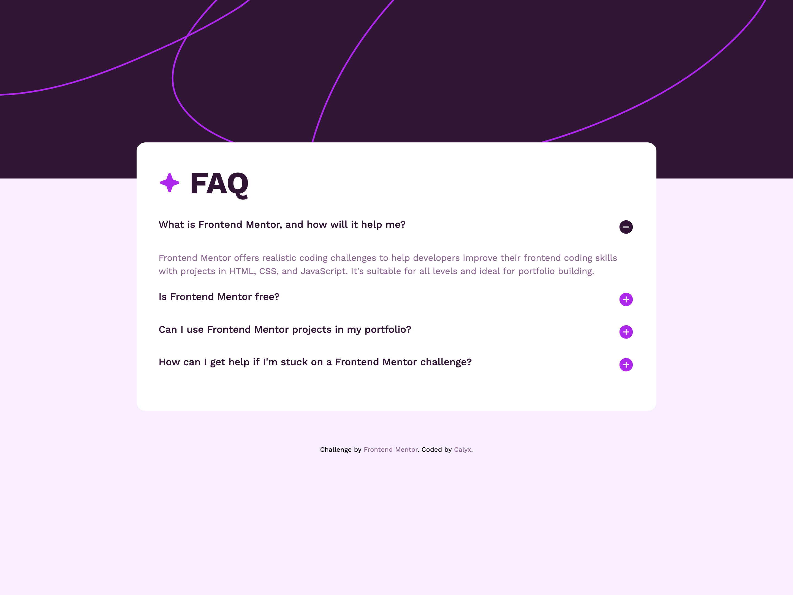

# Frontend Mentor - FAQ accordion solution

This is a solution to the [FAQ accordion challenge on Frontend Mentor](https://www.frontendmentor.io/challenges/faq-accordion-wyfFdeBwBz).

## Table of contents

- [Overview](#overview)
  - [The challenge](#the-challenge)
  - [Screenshot](#screenshot)
  - [Links](#links)
- [My process]
  - [Built with](#built-with)
  - [What I learned](#what-i-learned)
  - [Useful resources](#useful-resources)
- [Author](#author)

**Note: Delete this note and update the table of contents based on what sections you keep.**

## Overview

### The challenge

Users should be able to:

- Hide/Show the answer to a question when the question is clicked
- Navigate the questions and hide/show answers using keyboard navigation alone
- View the optimal layout for the interface depending on their device's screen size
- See hover and focus states for all interactive elements on the page

### Screenshot

### Links

- Solution URL: [https://github.com/calyxg/faq-accordion.git]
- Live Site URL: [https://calyxg.github.io/faq-accordion/]

### Built with

- Semantic HTML5 markup
- CSS custom properties
- Flexbox

### What I learned

I learnt to use details and summary elements to build the accordion component and used JS to close all other accordion items except the one that was currently active. Adding progressive enhancements to the shadowDOM element allowed me to include transitions on open and close of the accordion which can be seen using browsers that currently support this functionality.

### Useful resources

- [web.dev](https://web.dev/learn/html/details) - This clearly outlines the details and summary elements and how to use them.

## Author

- Frontend Mentor - [@calyxg](hhttps://www.frontendmentor.io/profile/calyxg)
